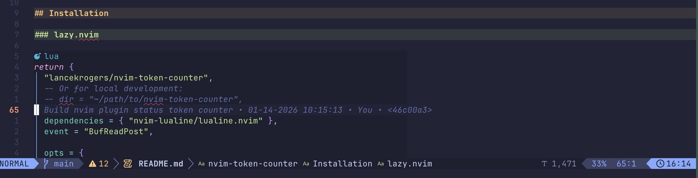

# nvim-token-counter

A Neovim plugin that displays token counts in your status line using [tcount](https://github.com/lancekrogers/go-token-counter), a fast zero-network token counter for LLM workflows.



## Features

- Displays token count in lualine status line
- Async execution (non-blocking, ~73ms per file)
- Per-buffer caching (no redundant calls)
- Updates on save (BufWritePost)
- Supports multiple tokenizer models (Claude, GPT, Llama, DeepSeek, Qwen)
- Exact BPE tokenization for OpenAI models, calibrated approximation for Claude
- Formatted numbers with commas (1,234)

## Requirements

- Neovim >= 0.9.0
- [lualine.nvim](https://github.com/nvim-lualine/lualine.nvim)
- [tcount](https://github.com/lancekrogers/go-token-counter) installed and in PATH

## Installing tcount

The plugin requires the `tcount` binary. Install it using one of these methods:

### Homebrew (macOS & Linux)

```bash
brew install lancekrogers/tap/tcount
```

### Go Install

```bash
go install github.com/lancekrogers/go-token-counter/cmd/tcount@latest
```

### Pre-built Binaries

Download from the [releases page](https://github.com/lancekrogers/go-token-counter/releases) for macOS, Linux, and Windows.

### From Source

```bash
git clone https://github.com/lancekrogers/go-token-counter.git
cd go-token-counter
go build -o bin/tcount ./cmd/tcount
# Copy bin/tcount to somewhere in your PATH
```

Verify the installation:

```bash
tcount --help
```

## Installation

### lazy.nvim

```lua
return {
  "lancekrogers/nvim-token-counter",
  -- Or for local development:
  -- dir = "~/path/to/nvim-token-counter",

  dependencies = { "nvim-lualine/lualine.nvim" },
  event = "BufReadPost",

  opts = {
    model = "claude-4.5-sonnet",  -- Tokenizer model
    icon = "󰊄",                   -- Display icon (nerd font)
    tcount_path = "tcount",       -- Path to tcount binary (auto-detected)
  },

  config = function(_, opts)
    require("nvim-token-counter").setup(opts)

    -- Add to lualine
    local lualine = require("lualine")
    local tc = require("nvim-token-counter")
    local config = lualine.get_config()

    table.insert(config.sections.lualine_x, 1, {
      tc.lualine_component(),
      cond = tc.lualine_cond(),
    })

    lualine.setup(config)
  end,
}
```

### LazyVim (lualine override method)

If you prefer to keep the lualine configuration separate:

```lua
-- lua/plugins/token-counter.lua
return {
  {
    "lancekrogers/nvim-token-counter",
    dependencies = { "nvim-lualine/lualine.nvim" },
    event = "BufReadPost",
    opts = {
      model = "claude-4.5-sonnet",
      icon = "󰊄",
    },
  },
  {
    "nvim-lualine/lualine.nvim",
    opts = function(_, opts)
      local tc = require("nvim-token-counter")
      table.insert(opts.sections.lualine_x, 1, {
        tc.lualine_component(),
        cond = tc.lualine_cond(),
      })
      return opts
    end,
  },
}
```

## Configuration

| Option | Type | Default | Description |
|--------|------|---------|-------------|
| `model` | string | `"claude-4.5-sonnet"` | Tokenizer model (see supported models below) |
| `icon` | string | `"󰊄"` | Icon displayed before token count |
| `tcount_path` | string | `"tcount"` | Path to tcount binary (auto-detected if in PATH) |
| `format` | string | `"%s %s"` | Display format (icon, count) |
| `enabled` | boolean | `true` | Enable/disable the plugin |
| `filetypes_exclude` | table | `{...}` | Filetypes to skip (neo-tree, help, etc.) |

### Supported Models

**Anthropic:** `claude-4-opus`, `claude-4-sonnet`, `claude-4.5-sonnet`, `claude-3.7-sonnet`, `claude-3.5-sonnet`, `claude-3-opus`, `claude-3-sonnet`, `claude-3-haiku`

**OpenAI:** `gpt-5`, `gpt-5-mini`, `gpt-4.1`, `gpt-4.1-mini`, `gpt-4.1-nano`, `gpt-4o`, `gpt-4o-mini`, `o3`, `o3-mini`, `o4-mini`, `gpt-4`, `gpt-4-turbo`, `gpt-3.5-turbo`

**Meta:** `llama-3.1-8b`, `llama-3.1-70b`, `llama-3.1-405b`, `llama-4-scout`, `llama-4-maverick`

**DeepSeek:** `deepseek-v2`, `deepseek-v3`, `deepseek-coder-v2`

**Qwen:** `qwen-2.5-7b`, `qwen-2.5-14b`, `qwen-2.5-72b`, `qwen-3-72b`

**Phi:** `phi-3-mini`, `phi-3-small`, `phi-3-medium`

## Commands

| Command | Description |
|---------|-------------|
| `:TokenCounterRecount` | Force recount for current buffer |
| `:TokenCounterEnable` | Enable the plugin |
| `:TokenCounterDisable` | Disable the plugin |
| `:TokenCounterToggle` | Toggle enable/disable |
| `:TokenCounterShow` | Show detailed count (tokens, chars, words, lines) |

## API

```lua
local tc = require("nvim-token-counter")

-- Setup with options
tc.setup({ model = "claude-4.5-sonnet", icon = "󰊄" })

-- Get lualine component and condition functions
tc.lualine_component()  -- Returns the component function
tc.lualine_cond()       -- Returns the condition function

-- Manual control
tc.recount()            -- Force recount current buffer
tc.enable()             -- Enable plugin
tc.disable()            -- Disable plugin
tc.toggle()             -- Toggle enabled state

-- Get raw count data
local count = tc.get_count()
if count then
  print(count.tokens)      -- Token count
  print(count.characters)  -- Character count
  print(count.words)       -- Word count
  print(count.lines)       -- Line count
end
```

## How It Works

1. On buffer enter (first time) or save, the plugin runs `tcount --json --model <model> <filepath>`
2. The command executes asynchronously using `vim.fn.jobstart()` (~73ms)
3. Results are cached per-buffer until the next save
4. The lualine component reads from cache and displays formatted count
5. Cache is cleaned up when buffers are deleted

## License

MIT
